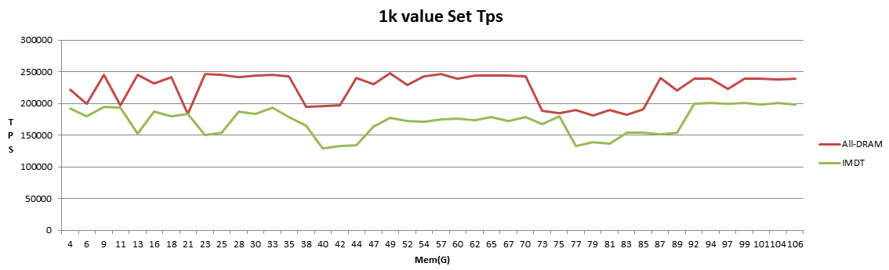
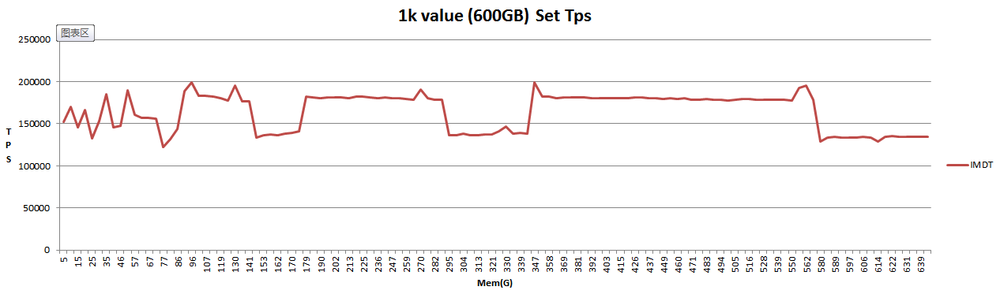

* content
{:toc}

背景
----------

自上次[Optane SSD虚拟内存Redis性能测试](https://githubmota.github.io/2017/12/27/Optane-SSD-Memory-Benchmark/)后，申请了一台内存为DRAM-only 8×16 GB且其他配置(operating systems and application versions,CPUs etc.)一致的机器。

    CPU: Intel(R) Xeon(R) CPU E5-2640 v3 @ 2.60GHz
    操作系统: CentOS Linux release 7.3.1611 (Core)

两台机器IMDT和非IMDT进行性能对比测试,以测试出IMDT进行内存扩展后性能是否降低, 降低的幅度.

IMDT: Intel Memory Drvie Technology

场景模拟
----------
机器A: 实际内存由8条16G DDR4组成，共128G，加入两块320G 的Optane SSD(每个CPU外接一个SSD)并执行相关安装设置后，内存扩展生效，变成650G.

机器B: 实际内存由8条16G DDR4组成，共128G.

Redis 4.0单实例，禁用rdb/aof及碎片整理功能

使用vire-benchmark(来自vipshop github仓库，多线程版本的redis-benchmark)进行性能测试,与Redis实例运行在同机器的同NUMA node上，使Redis实例CPU达到100%.

对vire-benchmark做了修改，增加参数`-R`选项(修改如下)，能依次遍历指定范围(0-2000w)数值key，即`-t set -R 20000000`时能依次写入`key:000000000000-key:000019999999`.

       @@ -163,7 +163,12 @@ static void randomizeClientKey(benchmark_client c) {
     
         for (i = 0; i < c->randkeylen; i++) {
             char *p = c->randkeyptr[i]+11;
    -        size_t r = random() % config.randomkeys_keyspacelen;
    +        size_t r;
    +        if (config.randomkeys == 1) {
    +            r = random() % config.randomkeys_keyspacelen;
    +        } else if (config.randomkeys == 2){
    +            r = (config.requests/config.threads_count*c->bt->id + c->bt->requests_issued-config.pipeline+i) % config.randomkeys_keyspacelen;
    +        }
             size_t j;
     
             for (j = 0; j < 12; j++) {
    @@ -465,10 +470,11 @@ static void writeHandler(aeEventLoop *el, int fd, void *privdata, int mask) {
         /* Initialize request when nothing was written. */
         if (c->written == 0) {
             /* Enforce upper bound to number of requests. */
    -        if (bt->requests_issued++ >= bt->requests) {
    +        if (bt->requests_issued >= bt->requests) {
                 freeClient(c);
                 return;
             }
    +        bt->requests_issued += config.pipeline;
     
             /* Really initialize: randomize keys and set start time. */
             if (config.randomkeys) randomizeClientKey(c);
    @@ -781,7 +787,7 @@ static void benchmark(char *title, char *cmd, int len) {
         clients_remainder = config.numclients%config.threads_count;
     
         bts = darray_create(config.threads_count, sizeof(benchmark_thread));
    -    for (i = 0; i < config.threads_count; i ++) {
    +    for (i = config.threads_count-1; i >= 0; i--) {
             benchmark_thread *bt = darray_push(bts);
             bt->id = i;
             benchmark_thread_init(bt,
    @@ -843,9 +849,10 @@ int parseOptions(int argc, const char **argv) {
                 if (lastarg) goto invalid;
                 config.pipeline = atoi(argv[++i]);
                 if (config.pipeline <= 0) config.pipeline=1;
    -        } else if (!strcmp(argv[i],"-r")) {
    +        } else if (!strcmp(argv[i],"-r") || !strcmp(argv[i],"-R")) {
                 if (lastarg) goto invalid;
                 config.randomkeys = 1;
    +            if(!strcmp(argv[i],"-R")) config.randomkeys = 2 ;
                 config.randomkeys_keyspacelen = atoi(argv[++i]);
                 if (config.randomkeys_keyspacelen < 0)
                     config.randomkeys_keyspacelen = 0;
 
测试场景如下:

1. Case1=1K value, 依次写入1亿个key， 再依次读取
2. Case2=10K value,依次写入1000w个key，再依次读取
3. Case3=100K value,依次写入90w个key，再依次读取

注: 写入数据量接近机器B 128G内存.

测试结果
----------

All-DRAM 100GB database测试结果

Test Case | Ops | Tps | TP99(ms) | Maxi Time(ms)
-|-|-|-|-|-
Case 1 | Set | 224530 | 2 | 61
       | Get | 232694 | 1 | 6
Case 2 | Set | 122382 | 2 | 25
       | Get | 157918 | 1 | 8
Case 3 | Set | 16177  | 8 | 15
       | Get | 23134  | 5 | 13

DRAM+2 Optane SSD (IMDT) 100GB database 测试结果

Test Case | Ops | Tps | TP99(ms) | Maxi Time(ms)
-|-|-|-|-|-
Case 1 | Set | 159887 | 4 | 191
       | Get | 180684 | 2 | 5
Case 2 | Set | 90300  | 4 | 52
       | Get | 133625 | 3 | 8
Case 3 | Set | 13217  | 24| 31
       | Get | 20917  | 6 | 30

图形化set 1k性能对比，横坐标为当前已使用内存，纵坐标为TPS.

从上面图表中看出在0-100GB数据场景下，写入new key的性能大概降至70%, 延迟波动比较大。读key的性能大概为80%

**针对1k value场景进一步测试:**

ALL-DRAM下100GB数据写完后，随机set key模拟更新操作:

Ops | Tps | TP99(ms) | Maxi Time(ms)
-|-|-|-
Set | 215800 | 1 | 1
Get | 229631 | 1 | 1

IMDT 600GB数据持续写入tps与已使用内存关系如下图：

从上图中可以看到IMDT下内存达到100GB和600GB时tps无差异.

IMDT 600GB数据写完后，随机set key模拟更新操作:

Ops | Tps | TP99(ms) | Maxi Time(ms)
-|-|-|-
Set | 58377 | 6 | 7
Get | 61206 | 6 | 7

即冷数据set性能为DRAM的58377/215800=27%
get性能为DRAM的61206/229631=26.7%

对其中100GB数据持续访问使其变成热数据，然后测试其性能:

Ops | Tps | TP99(ms) | Maxi Time(ms)
-|-|-|-
Set | 184604 | 1 | 1
Get | 196066 | 1 | 1

即热数据set性能为Dram的184604/215800=85.5%
get性能为Dram的196066/229631=85.4%

总结
----------
1. IMDT其热数据读写性能为DRAM的85%,冷数据读写性能为DRAM的27%
2. 新key的写入应该是使用到DRAM，其写性能为DRAM的70%
3. 热数据最大空间为机器的DRAM大小

参考
----------

[Optane SSD虚拟内存Redis性能测试](https://githubmota.github.io/2017/12/27/Optane-SSD-Memory-Benchmark/)
